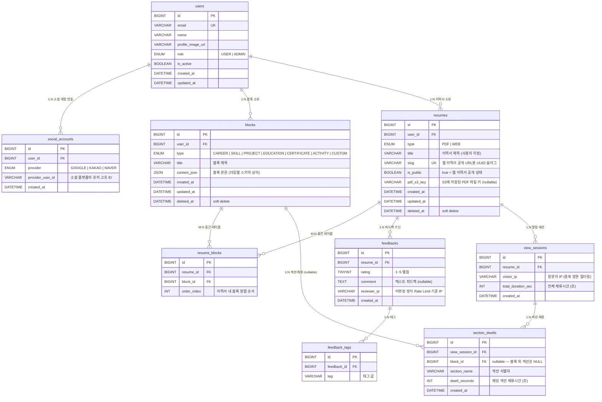

# Atomic CV — ERD (Draft v0.2)

> 작성일: 2026-04-30
> 최종 업데이트: 2026-05-15
> 상태: 1차 확정 (DDL 작성 완료, 2026-05-07)
> 기반: DDD Bounded Context 설계 / MySQL
> DDL 파일: `doc/erd_cloud_import.sql`

---

## 목차

1. [연관관계 요약](#1-연관관계-요약)
2. [ERD 다이어그램 (Mermaid)](#2-erd-다이어그램-mermaid)
3. [테이블 상세 명세](#3-테이블-상세-명세)
4. [설계 결정 포인트](#4-설계-결정-포인트)

---

## 1. 연관관계 요약

| 테이블 A | 관계 | 테이블 B | 설명 |
|---------|------|---------|------|
| users | 1 : N | social_accounts | 한 유저가 여러 소셜 계정을 연동할 수 있다 (Google·Kakao·Naver) |
| users | 1 : N | blocks | 한 유저가 여러 콘텐츠 블록을 보유한다 |
| users | 1 : N | resumes | 한 유저가 여러 이력서를 생성한다 |
| resumes | **M : N** | blocks | 한 이력서는 여러 블록을 포함하고, 한 블록은 여러 이력서에 사용된다 → 중간 테이블 `resume_blocks` |
| resumes | 1 : N | feedbacks | 한 이력서에 여러 피드백이 달린다 |
| resumes | 1 : N | view_sessions | 한 이력서에 여러 열람 세션이 기록된다 |
| feedbacks | 1 : N | feedback_tags | 한 피드백에 여러 태그가 붙는다 |
| view_sessions | 1 : N | section_dwells | 한 열람 세션에서 섹션별 체류시간이 기록된다 |
| section_dwells | N : 1 | blocks | 섹션 체류시간은 특정 블록과 연결될 수 있다 (nullable) |

> **MVP 보류**: `resume_versions` (버전 스냅샷), `notifications` (알림) 테이블은 Phase 2 이후 추가 예정

---

## 2. ERD 다이어그램 (Mermaid)

---

## 3. 테이블 상세 명세

### AUTH CONTEXT

---

#### `users` — 회원

| 컬럼 | 타입 | 제약 | 설명 |
|------|------|------|------|
| id | BIGINT | PK, AUTO_INCREMENT | 회원 고유 식별자 |
| email | VARCHAR(255) | UNIQUE, NOT NULL | 소셜 로그인 이메일 |
| name | VARCHAR(100) | NOT NULL | 표시 이름 |
| profile_image_url | VARCHAR(500) | NULL 허용 | S3 또는 소셜 프로필 이미지 URL |
| role | ENUM('USER','ADMIN') | NOT NULL, DEFAULT 'USER' | 권한 레벨 |
| is_active | BOOLEAN | NOT NULL, DEFAULT TRUE | false = 정지 계정 |
| created_at | DATETIME | NOT NULL | 가입 일시 |
| updated_at | DATETIME | NOT NULL | 마지막 수정 일시 |

**인덱스**
- `idx_users_email` — 로그인 조회 최적화

---

#### `social_accounts` — 소셜 연동 계정

| 컬럼 | 타입 | 제약 | 설명 |
|------|------|------|------|
| id | BIGINT | PK, AUTO_INCREMENT | 소셜 계정 고유 식별자 |
| user_id | BIGINT | FK → users.id, NOT NULL | 연동된 회원 |
| provider | ENUM('GOOGLE','KAKAO','NAVER') | NOT NULL | OAuth2 제공자 |
| provider_user_id | VARCHAR(255) | NOT NULL | 소셜 플랫폼이 발급한 유저 고유 ID |
| created_at | DATETIME | NOT NULL | 연동 일시 |

**제약**
- UNIQUE(provider, provider_user_id) — 동일 소셜 플랫폼의 동일 유저 중복 등록 방지

> 한 유저가 여러 소셜 계정(Google + Kakao 등) 동시 연동 가능. users 1:N 구조 유지 (합치기 안 함).

---

### BLOCK CONTEXT

---

#### `blocks` — 콘텐츠 블록

| 컬럼 | 타입 | 제약 | 설명 |
|------|------|------|------|
| id | BIGINT | PK, AUTO_INCREMENT | 블록 고유 식별자 |
| user_id | BIGINT | FK → users.id, NOT NULL | 블록 소유자 |
| type | ENUM('CAREER','SKILL','PROJECT','EDUCATION','CERTIFICATE','ACTIVITY','CUSTOM') | NOT NULL | 블록 타입 |
| title | VARCHAR(200) | NOT NULL | 블록 제목 |
| content_json | JSON | NOT NULL | 블록 본문 (타입별 스키마 상이) |
| created_at | DATETIME | NOT NULL | 생성 일시 |
| updated_at | DATETIME | NOT NULL | 마지막 수정 일시 |
| deleted_at | DATETIME | NULL 허용 | Soft Delete 처리 일시 |

**인덱스**
- `idx_blocks_user_id` — 유저별 블록 목록 조회
- `idx_blocks_user_type` — 타입별 필터링

> 블록 라이브러리 내 전역 순서(order_index) MVP 제외. 이력서 내 순서는 `resume_blocks.order_index`로 관리.

---

### RESUME CONTEXT

---

#### `resumes` — 이력서

| 컬럼 | 타입 | 제약 | 설명 |
|------|------|------|------|
| id | BIGINT | PK, AUTO_INCREMENT | 이력서 고유 식별자 |
| user_id | BIGINT | FK → users.id, NOT NULL | 이력서 소유자 |
| type | ENUM('PDF','WEB') | NULL 허용 | 이력서 종류 구분. PDF = PDF 빌더용, WEB = 웹 이력서 발행용 |
| title | VARCHAR(200) | NOT NULL | 이력서 제목 |
| slug | VARCHAR(100) | UNIQUE, NOT NULL | 웹 이력서 공개 URL 슬러그 (랜덤 UUID, `/r/{slug}`) |
| is_public | BOOLEAN | NOT NULL, DEFAULT FALSE | true = 웹 이력서 공개 상태 |
| pdf_s3_key | VARCHAR(500) | NULL 허용 | FE가 업로드한 PDF의 S3 객체 키. 미생성 시 NULL |
| created_at | DATETIME | NOT NULL | 생성 일시 |
| updated_at | DATETIME | NOT NULL | 마지막 수정 일시 |
| deleted_at | DATETIME | NULL 허용 | Soft Delete 처리 일시 |

**인덱스**
- `idx_resumes_user_id` — 유저별 이력서 목록 조회
- `idx_resumes_slug` — 웹 이력서 슬러그 조회

---

#### `resume_blocks` — 이력서-블록 M:N 중간 테이블

| 컬럼 | 타입 | 제약 | 설명 |
|------|------|------|------|
| id | BIGINT | PK, AUTO_INCREMENT | 중간 테이블 고유 식별자 |
| resume_id | BIGINT | FK → resumes.id, NOT NULL | 연결된 이력서 |
| block_id | BIGINT | FK → blocks.id, NOT NULL | 연결된 블록 |
| order_index | INT | NOT NULL | 이력서 내 블록 정렬 순서 |

**제약**
- UNIQUE(resume_id, block_id) — 같은 이력서에 같은 블록 중복 추가 방지

---

### FEEDBACK CONTEXT

---

#### `feedbacks` — 피드백

| 컬럼 | 타입 | 제약 | 설명 |
|------|------|------|------|
| id | BIGINT | PK, AUTO_INCREMENT | 피드백 고유 식별자 |
| resume_id | BIGINT | FK → resumes.id, NOT NULL | 피드백 대상 이력서 |
| rating | TINYINT | NOT NULL | 별점 1~5 |
| comment | TEXT | NULL 허용 | 텍스트 피드백 |
| reviewer_ip | VARCHAR(45) | NOT NULL | Rate Limit 기준 IP (IPv6 포함 45자) |
| created_at | DATETIME | NOT NULL | 피드백 제출 일시 |

**인덱스**
- `idx_feedbacks_resume_id` — 이력서별 피드백 목록 조회
- `idx_feedbacks_reviewer_ip_created` — Rate Limit 조회 (IP + 시간)

> 완전 익명 피드백으로 단순화. reviewer_name·reviewer_email 제거.

---

#### `feedback_tags` — 피드백 태그

| 컬럼 | 타입 | 제약 | 설명 |
|------|------|------|------|
| id | BIGINT | PK, AUTO_INCREMENT | 태그 고유 식별자 |
| feedback_id | BIGINT | FK → feedbacks.id, NOT NULL | 소속 피드백 |
| tag | VARCHAR(50) | NOT NULL | 태그 값 |

---

### ANALYTICS CONTEXT

---

#### `view_sessions` — 열람 세션

| 컬럼 | 타입 | 제약 | 설명 |
|------|------|------|------|
| id | BIGINT | PK, AUTO_INCREMENT | 세션 고유 식별자 |
| resume_id | BIGINT | FK → resumes.id, NOT NULL | 열람된 이력서 |
| visitor_ip | VARCHAR(45) | NOT NULL | 방문자 IP (중복 방문 카운트 필터링) |
| total_duration_sec | INT | NULL 허용 | 전체 체류시간 (초) |
| created_at | DATETIME | NOT NULL | 레코드 생성 일시 |

**인덱스**
- `idx_view_sessions_resume_id` — 이력서별 열람 집계

---

#### `section_dwells` — 섹션별 체류시간

| 컬럼 | 타입 | 제약 | 설명 |
|------|------|------|------|
| id | BIGINT | PK, AUTO_INCREMENT | 체류 기록 고유 식별자 |
| view_session_id | BIGINT | FK → view_sessions.id, NOT NULL | 소속 열람 세션 |
| block_id | BIGINT | FK → blocks.id, NULL 허용 | 연관 블록. 헤더·요약 섹션 등은 NULL |
| section_name | VARCHAR(100) | NOT NULL | 섹션 식별자 |
| dwell_seconds | INT | NOT NULL | 해당 섹션 체류시간 (초) |
| created_at | DATETIME | NOT NULL | 레코드 생성 일시 |

---

## 4. 설계 결정 포인트

### ✅ 확정된 설계 결정

| # | 이슈 | 결정 | 결정일 |
|---|------|------|--------|
| 1 | 블록 버전 관리 전략 | `block_versions` 미구현. 버전 스냅샷 전체 보류 | 2026-05-07 |
| 2 | resume_blocks 필요 여부 | 유지 (실시간 편집 구성 분리) | 2026-05-07 |
| 3 | reviewer_ip 저장 방식 | 원문 저장 VARCHAR(45) | 2026-05-07 |
| 4 | notifications 테이블 위치 | MVP에서 테이블 전체 제거 → Phase 2 이후 추가 | 2026-05-07 |
| 5 | soft delete 범위 | users·blocks·resumes 3개 테이블만 적용 | 2026-05-07 |
| 6 | 블록 저장 단위 | 일괄 저장 (FE가 전체 블록 상태 일괄 전송) | 2026-05-07 |
| 7 | 슬러그 구조 | 랜덤 UUID 자동 생성, 사용자 지정 미지원 (MVP 이후 검토) | 2026-05-07 |
| 8 | users·social_accounts 통합 여부 | 통합 안 함. 1:N 유지 (멀티 소셜 연동 지원) | 2026-05-07 |
| 9 | 피드백 익명화 | 완전 익명. reviewer_name·reviewer_email 제거 | 2026-05-07 |
| 10 | resume_blocks.is_visible 제거 | 숨김 처리 기능 MVP 제외 결정 | 2026-05-15 |
| 11 | view_sessions 컬럼 축소 | user_agent·referrer·started_at·ended_at 제거. visitor_ip + total_duration_sec + created_at만 유지 | 2026-05-15 |

### 기존 확정된 사항

- 인증: 소셜 로그인 전용 (Google / Kakao / Naver OAuth2) — 이메일 인증 미사용 (2026-05-02)
- PDF 생성: FE 단독 처리, BE는 데이터 API + S3 업로드 API만 제공
- DDL 파일: `doc/erd_cloud_import.sql` (2026-05-07 작성 완료)
