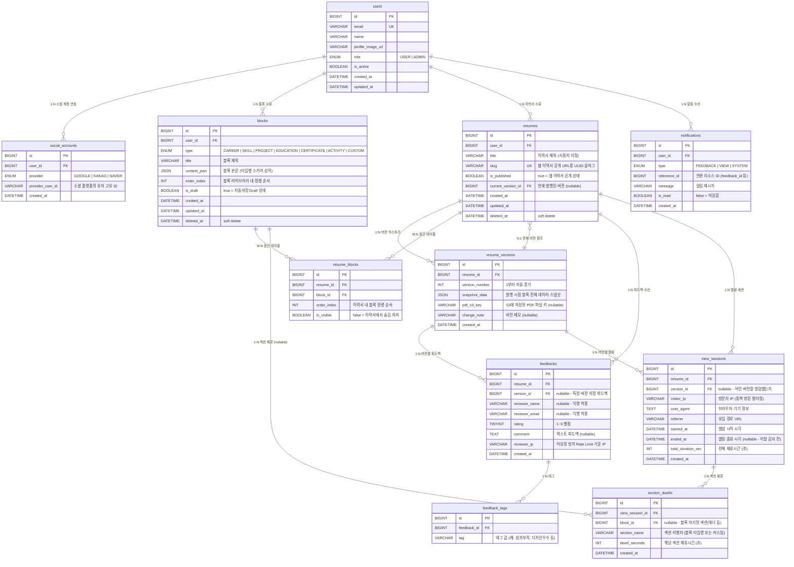

# Atomic CV — ERD 초안 (Draft v0.1)

> 작성일: 2026-04-30
> 상태: 초안 (팀 회의 논의용)
> 기반: DDD Bounded Context 설계 / MySQL

---

## 목차

1. [연관관계 요약](#1-연관관계-요약)
2. [ERD 다이어그램 (Mermaid)](#2-erd-다이어그램-mermaid)
3. [테이블 상세 명세](#3-테이블-상세-명세)
4. [설계 결정 포인트 (회의 논의용)](#4-설계-결정-포인트-회의-논의용)

---

## 1. 연관관계 요약

| 테이블 A | 관계 | 테이블 B | 설명 |
|---------|------|---------|------|
| users | 1 : N | social_accounts | 한 유저가 여러 소셜 계정을 연동할 수 있다 (Google·Kakao·Naver) |
| users | 1 : N | blocks | 한 유저가 여러 콘텐츠 블록을 보유한다 |
| users | 1 : N | resumes | 한 유저가 여러 이력서를 생성한다 |
| users | 1 : N | notifications | 한 유저가 여러 알림을 수신한다 |
| resumes | 1 : N | resume_versions | 한 이력서는 여러 버전(스냅샷)을 가진다 |
| resumes | **M : N** | blocks | 한 이력서는 여러 블록을 포함하고, 한 블록은 여러 이력서에 사용된다 → 중간 테이블 `resume_blocks` |
| resumes | 1 : N | feedbacks | 한 이력서에 여러 피드백이 달린다 |
| resumes | 1 : N | view_sessions | 한 이력서에 여러 열람 세션이 기록된다 |
| resume_versions | 1 : N | feedbacks | 특정 버전에 대한 피드백을 추적할 수 있다 |
| resume_versions | 1 : N | view_sessions | 어떤 버전을 열람했는지 추적한다 |
| feedbacks | 1 : N | feedback_tags | 한 피드백에 여러 태그가 붙는다 |
| view_sessions | 1 : N | section_dwells | 한 열람 세션에서 섹션별 체류시간이 기록된다 |
| section_dwells | N : 1 | blocks | 섹션 체류시간은 특정 블록과 연결될 수 있다 (nullable) |

---

## 2. ERD 다이어그램 (Mermaid)

---

## 3. 테이블 상세 명세

### AUTH CONTEXT

---

#### `users` — 회원

| 컬럼 | 타입 | 제약 | 설명 |
|------|------|------|------|
| id | BIGINT | PK, AUTO_INCREMENT | 회원 고유 식별자 |
| email | VARCHAR(255) | UNIQUE, NOT NULL | 로그인 이메일. 소셜 로그인 시 소셜 이메일 사용 |
| name | VARCHAR(100) | NOT NULL | 표시 이름 |
| profile_image_url | VARCHAR(500) | NULL 허용 | S3 또는 소셜 프로필 이미지 URL |
| role | ENUM('USER','ADMIN') | NOT NULL, DEFAULT 'USER' | 권한 레벨 |
| is_active | BOOLEAN | NOT NULL, DEFAULT TRUE | 소셜 로그인 시 즉시 활성화. false = 정지 계정 |
| created_at | DATETIME | NOT NULL | 가입 일시 |
| updated_at | DATETIME | NOT NULL | 마지막 수정 일시 |

**인덱스**
- `idx_users_email` — 로그인 조회 최적화

---

#### `social_accounts` — 소셜 연동 계정

| 컬럼 | 타입 | 제약 | 설명 |
|------|------|------|------|
| id | BIGINT | PK, AUTO_INCREMENT | 소셜 계정 고유 식별자 |
| user_id | BIGINT | FK → users.id, NOT NULL | 연동된 회원 |
| provider | ENUM('GOOGLE','KAKAO','NAVER') | NOT NULL | OAuth2 제공자 |
| provider_user_id | VARCHAR(255) | NOT NULL | 소셜 플랫폼이 발급한 유저 고유 ID |
| created_at | DATETIME | NOT NULL | 연동 일시 |

**제약**
- UNIQUE(provider, provider_user_id) — 동일 소셜 플랫폼의 동일 유저 중복 등록 방지

---

### BLOCK CONTEXT

---

#### `blocks` — 콘텐츠 블록

| 컬럼 | 타입 | 제약 | 설명 |
|------|------|------|------|
| id | BIGINT | PK, AUTO_INCREMENT | 블록 고유 식별자 |
| user_id | BIGINT | FK → users.id, NOT NULL | 블록 소유자 |
| type | ENUM('CAREER','SKILL','PROJECT','EDUCATION','CERTIFICATE','ACTIVITY','CUSTOM') | NOT NULL | 블록 타입. 타입별로 content_json 스키마가 다름 |
| title | VARCHAR(200) | NOT NULL | 블록 제목 (예: "카카오 백엔드 인턴십") |
| content_json | JSON | NOT NULL | 블록 본문. 타입별 필드 상이 (경력: 회사명·기간·업무설명, 기술: 스택명·숙련도 등) |
| order_index | INT | NOT NULL, DEFAULT 0 | 블록 라이브러리 내 정렬 순서 |
| is_draft | BOOLEAN | NOT NULL, DEFAULT FALSE | true = 자동저장 중인 미완성 Draft |
| created_at | DATETIME | NOT NULL | 생성 일시 |
| updated_at | DATETIME | NOT NULL | 마지막 수정 일시 |
| deleted_at | DATETIME | NULL 허용 | Soft Delete 처리 일시 |

**인덱스**
- `idx_blocks_user_id` — 유저별 블록 목록 조회
- `idx_blocks_user_type` — 타입별 필터링

---

### RESUME CONTEXT

---

#### `resumes` — 이력서

| 컬럼 | 타입 | 제약 | 설명 |
|------|------|------|------|
| id | BIGINT | PK, AUTO_INCREMENT | 이력서 고유 식별자 |
| user_id | BIGINT | FK → users.id, NOT NULL | 이력서 소유자 |
| title | VARCHAR(200) | NOT NULL | 이력서 제목 (예: "카카오 지원용 이력서") |
| slug | VARCHAR(100) | UNIQUE, NOT NULL | 웹 이력서 공개 URL 슬러그 (UUID 기반, `/r/{slug}`) |
| is_published | BOOLEAN | NOT NULL, DEFAULT FALSE | true = 웹 이력서 공개 상태 |
| current_version_id | BIGINT | FK → resume_versions.id, NULL 허용 | 현재 발행된 버전. 미발행 시 NULL |
| created_at | DATETIME | NOT NULL | 생성 일시 |
| updated_at | DATETIME | NOT NULL | 마지막 수정 일시 |
| deleted_at | DATETIME | NULL 허용 | Soft Delete 처리 일시 |

**인덱스**
- `idx_resumes_user_id` — 유저별 이력서 목록 조회
- `idx_resumes_slug` — 웹 이력서 슬러그 조회

---

#### `resume_versions` — 이력서 버전 (스냅샷)

| 컬럼 | 타입 | 제약 | 설명 |
|------|------|------|------|
| id | BIGINT | PK, AUTO_INCREMENT | 버전 고유 식별자 |
| resume_id | BIGINT | FK → resumes.id, NOT NULL | 소속 이력서 |
| version_number | INT | NOT NULL | 이력서별 1부터 자동 증가 |
| snapshot_data | JSON | NOT NULL | 발행 시점 블록 전체 데이터 스냅샷. 블록 수정 이후에도 과거 버전 복원 가능 |
| pdf_s3_key | VARCHAR(500) | NULL 허용 | FE가 생성하여 업로드한 PDF의 S3 객체 키. PDF 미생성 시 NULL |
| change_note | VARCHAR(200) | NULL 허용 | 버전 변경 메모 |
| created_at | DATETIME | NOT NULL | 버전 생성(발행) 일시 |

**제약**
- UNIQUE(resume_id, version_number) — 같은 이력서에서 버전 번호 중복 방지

---

#### `resume_blocks` — 이력서-블록 M:N 중간 테이블

| 컬럼 | 타입 | 제약 | 설명 |
|------|------|------|------|
| id | BIGINT | PK, AUTO_INCREMENT | 중간 테이블 고유 식별자 |
| resume_id | BIGINT | FK → resumes.id, NOT NULL | 연결된 이력서 |
| block_id | BIGINT | FK → blocks.id, NOT NULL | 연결된 블록 |
| order_index | INT | NOT NULL | 이력서 내 블록 정렬 순서 (라이브러리 순서와 별개) |
| is_visible | BOOLEAN | NOT NULL, DEFAULT TRUE | false = 이력서에서 숨김 처리 (블록 삭제 없이 숨기기) |

**제약**
- UNIQUE(resume_id, block_id) — 같은 이력서에 같은 블록 중복 추가 방지

> **설계 의도**: `resume_blocks`는 현재 편집 중인 이력서 구성(실시간)을 관리한다.
> 발행(publish) 시점에 `resume_versions.snapshot_data`에 전체 블록 내용을 JSON으로 스냅샷 저장하여,
> 이후 블록이 수정되더라도 과거 버전 복원이 가능하다.

---

### FEEDBACK CONTEXT

---

#### `feedbacks` — 피드백

| 컬럼 | 타입 | 제약 | 설명 |
|------|------|------|------|
| id | BIGINT | PK, AUTO_INCREMENT | 피드백 고유 식별자 |
| resume_id | BIGINT | FK → resumes.id, NOT NULL | 피드백 대상 이력서 |
| version_id | BIGINT | FK → resume_versions.id, NULL 허용 | 특정 버전에 대한 피드백 (NULL이면 최신 버전) |
| reviewer_name | VARCHAR(100) | NULL 허용 | 리뷰어 이름. 익명 허용 |
| reviewer_email | VARCHAR(255) | NULL 허용 | 리뷰어 이메일. 익명 허용 |
| rating | TINYINT | NOT NULL | 별점 1~5 |
| comment | TEXT | NULL 허용 | 텍스트 피드백 |
| reviewer_ip | VARCHAR(45) | NOT NULL | Rate Limit 기준 IP. IPv6 포함하여 45자 |
| created_at | DATETIME | NOT NULL | 피드백 제출 일시 |

**인덱스**
- `idx_feedbacks_resume_id` — 이력서별 피드백 목록 조회
- `idx_feedbacks_reviewer_ip_created` — Rate Limit 조회 (IP + 시간 기준)

---

#### `feedback_tags` — 피드백 태그

| 컬럼 | 타입 | 제약 | 설명 |
|------|------|------|------|
| id | BIGINT | PK, AUTO_INCREMENT | 태그 고유 식별자 |
| feedback_id | BIGINT | FK → feedbacks.id, NOT NULL | 소속 피드백 |
| tag | VARCHAR(50) | NOT NULL | 태그 값 (예: `성과_부족`, `디자인_우수`, `분량_적절` 등) |

---

#### `notifications` — 알림

| 컬럼 | 타입 | 제약 | 설명 |
|------|------|------|------|
| id | BIGINT | PK, AUTO_INCREMENT | 알림 고유 식별자 |
| user_id | BIGINT | FK → users.id, NOT NULL | 알림 수신 유저 |
| type | ENUM('FEEDBACK','VIEW','SYSTEM') | NOT NULL | 알림 종류 |
| reference_id | BIGINT | NULL 허용 | 연관 리소스 ID (FEEDBACK이면 feedback_id 등) |
| message | VARCHAR(500) | NOT NULL | 알림 메시지 본문 |
| is_read | BOOLEAN | NOT NULL, DEFAULT FALSE | false = 미읽음 |
| created_at | DATETIME | NOT NULL | 알림 생성 일시 |

**인덱스**
- `idx_notifications_user_id_is_read` — 유저별 미읽음 알림 목록 조회

---

### ANALYTICS CONTEXT

---

#### `view_sessions` — 열람 세션

| 컬럼 | 타입 | 제약 | 설명 |
|------|------|------|------|
| id | BIGINT | PK, AUTO_INCREMENT | 세션 고유 식별자 |
| resume_id | BIGINT | FK → resumes.id, NOT NULL | 열람된 이력서 |
| version_id | BIGINT | FK → resume_versions.id, NULL 허용 | 열람된 버전 (NULL이면 최신 버전) |
| visitor_ip | VARCHAR(45) | NOT NULL | 방문자 IP (중복 방문 카운트 필터링) |
| user_agent | TEXT | NULL 허용 | 브라우저·OS 정보 |
| referrer | VARCHAR(500) | NULL 허용 | 유입 경로 URL |
| started_at | DATETIME | NOT NULL | 열람 시작 시각 |
| ended_at | DATETIME | NULL 허용 | 열람 종료 시각. 세션 미종료 시 NULL |
| total_duration_sec | INT | NULL 허용 | 전체 체류시간 (초). ended_at 설정 시 계산 |
| created_at | DATETIME | NOT NULL | 레코드 생성 일시 |

**인덱스**
- `idx_view_sessions_resume_id` — 이력서별 열람 집계
- `idx_view_sessions_resume_started` — 날짜 범위 조회

---

#### `section_dwells` — 섹션별 체류시간

| 컬럼 | 타입 | 제약 | 설명 |
|------|------|------|------|
| id | BIGINT | PK, AUTO_INCREMENT | 체류 기록 고유 식별자 |
| view_session_id | BIGINT | FK → view_sessions.id, NOT NULL | 소속 열람 세션 |
| block_id | BIGINT | FK → blocks.id, NULL 허용 | 연관 블록. 헤더·요약 섹션 등 블록 외 영역은 NULL |
| section_name | VARCHAR(100) | NOT NULL | 섹션 식별자 (블록 타입명 또는 커스텀 키 예: `header`, `career_kakao`) |
| dwell_seconds | INT | NOT NULL | 해당 섹션 체류시간 (초) |
| created_at | DATETIME | NOT NULL | 레코드 생성 일시 |

---

## 4. 설계 결정 포인트 (회의 논의용)

### ❓ 결정 필요

| # | 이슈 | 선택지 | 영향 |
|---|------|--------|------|
| 1 | **블록 버전 관리 전략** | A) `snapshot_data` JSON 스냅샷 (현재 초안) / B) `block_versions` 별도 테이블 | A는 조회 단순, B는 블록 변경 이력 추적 가능 |
| 2 | **resume_blocks 필요 여부** | A) 현재 구성 분리 유지 (초안) / B) snapshot만 사용, resume_blocks 제거 | A는 실시간 편집 용이, B는 테이블 수 감소 |
| 3 | **reviewer_ip 저장 방식** | A) 원문 저장 / B) SHA-256 해싱 후 저장 | B는 개인정보 보호, Rate Limit은 동일하게 동작 |
| 4 | **notifications Context 위치** | A) Feedback Context 유지 (초안) / B) shared 모듈로 분리 | B는 확장성 유리 (VIEW·SYSTEM 알림 추가 시) |
| 5 | **soft delete 범위** | 현재: users, blocks, resumes만 적용 / 다른 테이블도 적용? | 피드백·알림은 hard delete로도 충분할 수 있음 |

### ✅ 확정된 사항

- 인증: 소셜 로그인 전용 (Google / Kakao / Naver OAuth2) — 이메일 인증 미사용 (2026-05-02 결정)
- PDF 생성: FE 단독 처리, BE는 데이터 API + S3 업로드 API만 제공
- Slug 방식: UUID 기반 자동 생성 (사용자 지정 slug 미지원 — MVP 이후 검토)
- 소셜 로그인: Google, Kakao, Naver 3종

---

> 이 문서는 팀 논의 후 `ERD.md`로 확정 버전을 별도 작성합니다.
